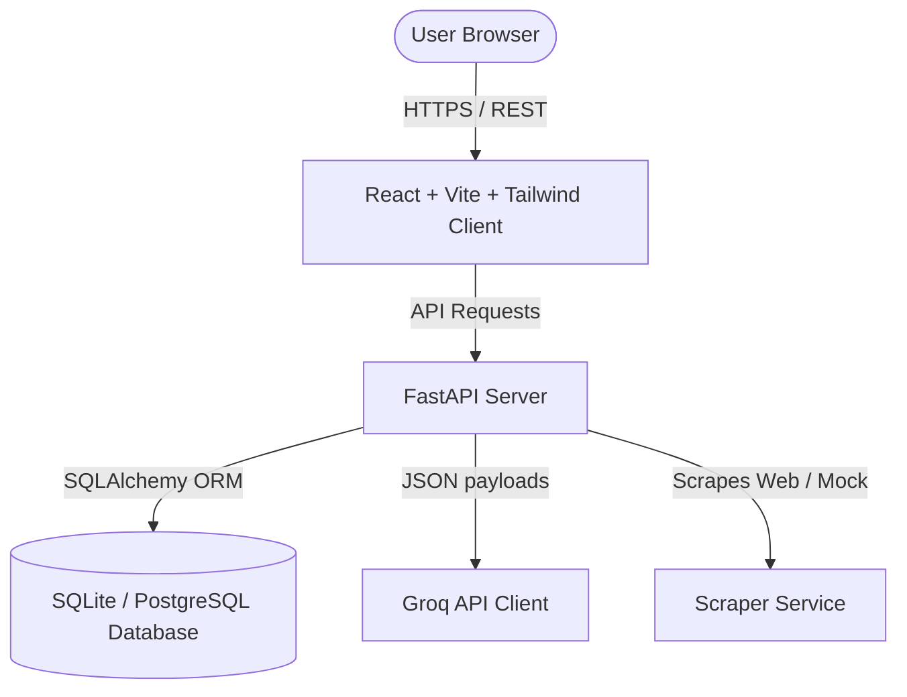

# System Design Document - INTERNTRAC

## 1. System Architecture Overview

INTERNTRAC is designed as a decoupled client-server application. It consists of a React client, a FastAPI server, and a SQLite/PostgreSQL relational database. AI processing is delegated to Groq's high-speed inference engine using standard REST integration.



---

## 2. Directory Structure

We will structure the project workspace to support developer ergonomics, clean separation of concerns, and ease of deployment.

```
INTERNTRAC/
├── frontend/                  # React Frontend (Vite + TypeScript + Tailwind)
│   ├── src/
│   │   ├── components/        # Reusable UI Components (Cards, Layouts, Inputs)
│   │   ├── pages/             # Student, Institute, and Company Panel Views
│   │   ├── context/           # Authentication state & settings contexts
│   │   ├── services/          # API Client services (Axios hooks)
│   │   ├── assets/            # Static assets and icons
│   │   ├── App.tsx            # Main App & Router
│   │   └── main.tsx
│   ├── tailwind.config.js
│   ├── package.json
│   └── tsconfig.json
├── backend/                   # FastAPI Backend
│   ├── app/
│   │   ├── api/               # API Router modules (endpoints)
│   │   │   ├── auth.py        # Login, signup, token validation
│   │   │   ├── students.py    # Student profile & applications endpoints
│   │   │   ├── institutes.py  # Institute controls, NOCs, & mentor logs
│   │   │   ├── companies.py   # Company postings & application pipeline
│   │   │   └── ai.py          # Groq ATS screening API
│   │   ├── core/              # Global configurations & dependencies
│   │   │   ├── config.py      # Environment variables & constants
│   │   │   ├── db.py          # SQLAlchemy engine & session builders
│   │   │   └── security.py    # Password hashing & JWT logic
│   │   ├── models/            # Database entity definitions (SQLAlchemy models)
│   │   ├── services/          # Third-party integrations
│   │   │   ├── groq.py        # Groq Llama API interaction client
│   │   │   ├── scraper.py     # YC / Wellfound / Unstop mock & active scraper
│   │   │   └── pdf.py         # NOC and Certificate template rendering
│   │   └── main.py            # FastAPI Application startup and setup
│   ├── requirements.txt
│   └── Dockerfile
└── README.md
```

---

## 3. Database Schema Design

We will use relational tables mapped via SQLAlchemy models:

### 3.1 Core Users Table (`users`)
- `id` (UUID, PK)
- `email` (String, Unique, Indexed)
- `password_hash` (String)
- `role` (Enum: `STUDENT`, `INSTITUTE`, `COMPANY`, `ADMIN`)
- `created_at` (DateTime)

### 3.2 Student Profile (`student_profiles`)
- `id` (UUID, PK)
- `user_id` (UUID, FK -> `users.id`)
- `name` (String)
- `github_url` (String)
- `linkedin_url` (String)
- `resume_path` (String) - Local or Cloud storage link
- `skills` (JSON) - Array of parsed skills
- `institute_id` (UUID, FK -> `institute_profiles.id`, Nullable)

### 3.3 Institute Profile (`institute_profiles`)
- `id` (UUID, PK)
- `user_id` (UUID, FK -> `users.id`)
- `name` (String, Unique)
- `location` (String)
- `domain` (String) - For matching student signups (e.g. `collegename.edu`)

### 3.4 Company Profile (`company_profiles`)
- `id` (UUID, PK)
- `user_id` (UUID, FK -> `users.id`)
- `name` (String)
- `industry` (String)
- `website` (String)
- `logo_url` (String)
- `cin` (String, Nullable)
- `gstin` (String, Nullable)
- `msme_certificate_url` (String, Nullable)
- `verification_status` (Enum: `PENDING`, `APPROVED`, `REJECTED`)
- `verification_errors` (JSON, Nullable) - List of failing fields/descriptions flagged by AI

### 3.5 Internship Postings (`internships`)
- `id` (UUID, PK)
- `title` (String)
- `description` (Text)
- `requirements` (Text)
- `company_name` (String)
- `company_profile_id` (UUID, FK -> `company_profiles.id`, Nullable)
- `institute_profile_id` (UUID, FK -> `institute_profiles.id`, Nullable) - If exclusive
- `source` (Enum: `INTERNAL`, `SCRAPED`)
- `scraped_from` (String, Nullable) - Wellfound, YC, Unstop
- `stipend` (String, Nullable)
- `location` (String) - Remote/Hybrid/Onsite
- `created_at` (DateTime)

### 3.6 Internship Applications (`applications`)
- `id` (UUID, PK)
- `student_id` (UUID, FK -> `student_profiles.id`)
- `internship_id` (UUID, FK -> `internships.id`)
- `status` (Enum: `APPLIED`, `SHORTLISTED_FOR_INTERVIEW`, `INTERVIEWING`, `SELECTED`, `REJECTED`)
- `ats_score` (Integer, Nullable)
- `ai_verdict` (JSON, Nullable) - Mismatch reasons, strong metrics, recommendations
- `applied_at` (DateTime)

### 3.7 No Objection Certificates (`noc_requests`)
- `id` (UUID, PK)
- `student_id` (UUID, FK -> `student_profiles.id`)
- `institute_id` (UUID, FK -> `institute_profiles.id`)
- `internship_id` (UUID, FK -> `internships.id`)
- `status` (Enum: `PENDING`, `APPROVED`, `REJECTED`)
- `noc_document_path` (String, Nullable)

### 3.8 Attendance & Daily Logs (`attendance_logs`)
- `id` (UUID, PK)
- `student_id` (UUID, FK -> `student_profiles.id`)
- `date` (Date)
- `hours` (Float)
- `task_details` (Text)
- `status` (Enum: `PENDING`, `APPROVED`) - Signed off by mentor/institute

### 3.9 Mentor Feedback (`mentor_feedback`)
- `id` (UUID, PK)
- `student_id` (UUID, FK -> `student_profiles.id`)
- `mentor_name` (String)
- `feedback_text` (Text)
- `rating` (Integer) - 1 to 5 scale
- `created_at` (DateTime)

---

## 4. Groq AI Integration (ATS & Verification)

### 4.1 LLM Configuration
- **Model:** `llama-3.1-8b-instant` (very fast, low latency, structured JSON mode capable).
- **Resume Matching Service:**
  - Endpoint `POST /api/ai/screen-resume`
  - Input: Student resume text, Job title, Job description & requirements.
  - Output: Structured JSON conforming to:
  ```json
  {
    "score": 85,
    "verdict": "Strong candidate matching 4 of 5 requirements. Highly skilled in React, but lacks the requested AWS deployments experience.",
    "strengths": ["Strong frontend foundations", "Active GitHub contribution visible"],
    "skill_gaps": ["AWS Cloud Deployment", "CI/CD automation tooling"],
    "recommendations": ["Complete a basic AWS deployment tutorial.", "Deploy your current Vite project to AWS Amplify and link it in the profile."]
  }
  ```

### 4.2 ATS System Prompt Design
```
You are an expert technical recruiter and ATS (Applicant Tracking System) screening tool. 
Your task is to analyze the candidate's resume against the provided job description and evaluate their compatibility.
You MUST output a valid JSON document with the following keys: 'score' (integer 0-100), 'verdict' (concise paragraph), 'strengths' (array of strings), 'skill_gaps' (array of strings), and 'recommendations' (array of strings). Do not include any markdown format tags or conversational pleasantries outside the JSON block.
```

### 4.3 Company Credential Validator
- **Endpoint:** `POST /api/ai/verify-company`
- **Input:** Corporate Legal Name, Website Domain, CIN, GSTIN.
- **Output Schema:**
  ```json
  {
    "is_valid": false,
    "problems": [
      "CIN format invalid (missing 21-character structure)",
      "GSTIN state prefix does not align with corporate headquarters",
      "Domain name does not correspond to company brand profile"
    ]
  }
  ```
- **System Prompt:**
  ```
  You are a corporate regulatory validator. Your job is to check the structure and logical consistency of a company's CIN (21 characters), GSTIN (15 characters), domain registration, and legal name. 
  Assess formatting correctness and logical naming coherence.
  You MUST output a valid JSON document with: 'is_valid' (boolean) and 'problems' (array of strings, empty if all checks pass).
  ```

---

## 5. Automation Pipelines

1. **Auto-Shortlist Trigger (>= 75% Match):**
   When a student applies for an internship, the ATS engine processes their resume. If the match score is calculated as $\ge 75\%$, the backend automatically updates the application status to `SHORTLISTED_FOR_INTERVIEW` and logs this action. This eliminates manual screening stages for high-match candidates.
2. **Company Self-Verification:**
   Immediately when a company registers, the background task validates their CIN/GSTIN details. If failures are found, they are stored in `verification_errors` and the status remains `PENDING_VERIFICATION`. The institute panel is alerted of the registration and verification logs.
3. **Scraping Worker:**
   A utility script `services/scraper.py` queries popular jobs RSS/GraphQL endpoints or operates on simulated HTML nodes. If a third-party scraping query fails due to rate limits or cloudflare, the service immediately generates clean mock listings dynamically seeded from real tech roles.
4. **NOC & Offer/Completion Document Auto-Generation:**
   Uses ReportLab templates to compile student names, company dates, and academic details, and outputs signature-ready PDF files for direct download.
5. **Resume Parsing:**
   A background task extracts text strings from the user's PDF resume using `pypdf`, enabling instant profile setup.

